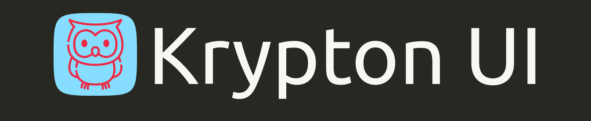

<div align=center></div>
<h2 align=center>Build Modular UI with ease.</h2>

Krypton UI is a simple, open source CSS component library that provides you the style blocks needed to build your web applications.

## Usage

Link the Library CSS and JS files to your HTML with the following lines:

```
<link rel="stylesheet" href="https://krypton-ui.netlify.app/main.css" />

<script src="https://krypton-ui.netlify.app/script.js"></script>       
```

You're all set to use Krypton UI in your project! 🎉

## Features

- Supports some of the commonly used UI components. 
- CSS Class names follow BEM naming convention, thus enabling a more logical, easy-to-read code structure.


## Documentation

For examples/usage instructions, refer to the below documentation site:

[Krypton UI Docs](https://krypton-ui-docs.netlify.app/)


